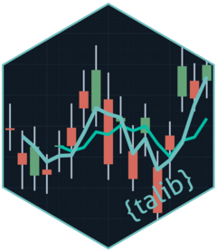

<!-- README.md is generated from README.Rmd. Please edit that file -->

```{r setup, include = FALSE}
# set options
Sys.setenv(OPENSSL_CONF="/dev/null")

knitr::opts_chunk$set(
  collapse = FALSE,
  comment  = "#>",
  fig.path = "man/figures/README-",
  message  = FALSE,
  warning  = FALSE,
  echo     = FALSE 
)
```

# {talib}: R bindings for [TA-Lib](https://github.com/TA-Lib/ta-lib) 

<!-- badges: start -->
[](https://github.com/serkor1/curly-giggle/actions/workflows/R-CMD-check.yaml)
[](https://app.codecov.io/gh/serkor1/curly-giggle)
[](https://CRAN.R-project.org/package=talib)
[](https://r-pkg.org/pkg/talib)
<!-- badges: end -->

[{talib}]() provides high-performance R bindings to the [TA-Lib](https://github.com/TA-Lib/ta-lib) C-library for Technical Analysis indicators, Candlestick patterns and interactive charting via [{plotly}]().

## Installation

### Stable version
```{r devel_install, echo = TRUE, eval = FALSE}
pak::pak("talib")
```

### Development version

The development version can be installed via:[^1]

```{r cran_install, echo = TRUE, eval = FALSE}
pak::pak("serkor1/curly-giggle")
```

Or it can be installed by cloning the repository:

```sh
git clone --recursive https://github.com/serkor1/ta-lib-R.git
cd ta-lib-R
make build
```

Use `make` for all package-level build-tools.

## Basic Usage

### Indicators
This is a basic example which shows you how to solve a common problem:

```{r indicator, echo = TRUE}
## calculate bollinger
## bands
tail(
  talib::bollinger_bands(
    talib::BTC
  )
)
```

### Charting

```{r charting, fig.align = 'center', fig.dpi = 180, echo = TRUE}
library(talib)

## calculate bollinger
## bands
x <- talib::BTC

{
  ## chart Bitcoin
  ## with candlesticks
  talib::chart(
    x = x
  )

  ## add bollinger bands
  ## to the chart
  talib::indicator(
    FUN = talib::SMA,
    cols = ~ close + open
  )

  ## add bollinger bands
  ## to the chart
  talib::indicator(
    FUN = talib::bollinger_bands
  )

  ## add RSI indicator
  ## to the chart
  talib::indicator(
    FUN = talib::relative_strength_index
  )

  ## add harami indicators
  ## to the chart
  talib::indicator(
    FUN = talib::harami
  )
}
```

## Code of Conduct
  
Please note that [{talib}]() is released with a [Contributor Code of Conduct](https://contributor-covenant.org/version/2/1/CODE_OF_CONDUCT.html). By contributing to this project, you agree to abide by its terms.


[^1]: Requires that [TA-Lib]() is preinstalled.