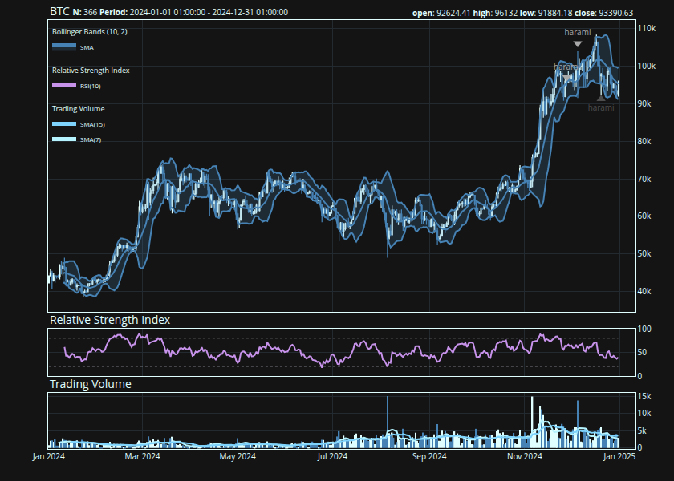

<!-- README.md is generated from README.Rmd. Please edit that file -->

# {talib}: R bindings for [TA-Lib](https://github.com/TA-Lib/ta-lib) 

<!-- badges: start -->

<!-- badges: end -->

The goal of talib is to …

## Installation

You can install the development version of talib from
[GitHub](https://github.com/) with:

``` r
# install.packages("pak")
pak::pak("serkor1/curly-giggle")
```

## Example

### Indicators

This is a basic example which shows you how to solve a common problem:

    #>            upper  middle    lower
    #> [4671,] 638.7501 630.155 621.5599
    #> [4672,] 640.8957 631.238 621.5803
    #> [4673,] 641.0360 632.456 623.8760
    #> [4674,] 641.5914 633.962 626.3326
    #> [4675,] 642.1847 633.662 625.1393
    #> [4676,] 642.7450 633.352 623.9590

### Charting


