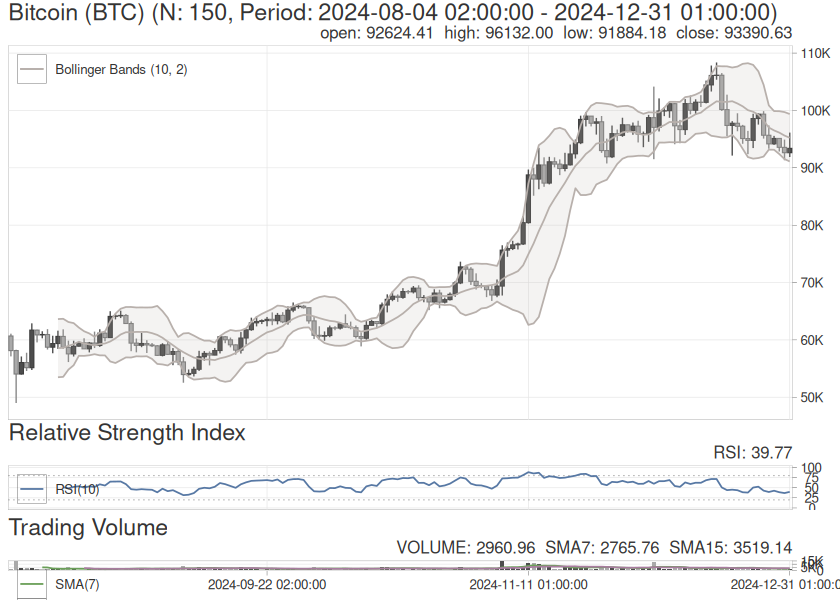

<!-- README.md is generated from dev/README.Rmd. Please edit that file -->

# {talib}: Candlestick Pattern Recognition and Technical Analysis in R 

<!-- badges: start -->

[](https://github.com/serkor1/ta-lib-R/actions/workflows/R-CMD-check.yaml)
[](https://github.com/serkor1/ta-lib-R/actions/workflows/remote-install.yaml)
[](https://app.codecov.io/gh/serkor1/ta-lib-R)
[](https://CRAN.R-project.org/package=talib)
[](https://r-pkg.org/pkg/talib)
<!-- badges: end -->

[{talib}](https://serkor1.github.io/ta-lib-R/) is an R package for
technical analysis, candlestick pattern recognition, and interactive
financial charting—built on the
[TA-Lib](https://github.com/TA-Lib/ta-lib) C library, with minimal
dependencies for long-term stability. When it comes to technical
analysis [{TTR}](https://github.com/joshuaulrich/TTR) has been the
primary tool available in R with many different libraries wrapping it in
some form or the other. [{TTR}](https://github.com/joshuaulrich/TTR) is
missing Japanese Candlestick Patterns, and this gap have been attempted
to be filled by [Ko Chiu
Yu](https://github.com/kochiuyu/CandleStickPattern/)—A library which I
have also attempted to contributed to. Instead of reinventing the wheel
I decided to wrap [TA-Lib](https://github.com/TA-Lib/ta-lib) which has
been around for more than two decades.

## Quick Introduction

All functions are based on `S3`-classes with dispatches on
`<data.frame>`, `<matrix>` and—where applicable—`<vector>`. The rule(s)
are simple: `<class>` in, `<class>` out.

Below are simple uses based on the built-in `<data.frame>` BTC.

``` r
head(
    BTC
)
#>                         open     high      low    close    volume
#> 2024-08-04 02:00:00 60675.44 61080.04 57120.00 58134.00  3074.478
#> 2024-08-05 02:00:00 58139.99 58280.01 49001.00 54044.80 15075.199
#> 2024-08-06 02:00:00 54047.99 57113.22 53952.77 56052.00  4326.535
#> 2024-08-07 02:00:00 56047.14 57757.99 54576.39 55147.74  3693.481
#> 2024-08-08 02:00:00 55147.74 62887.50 54747.99 61707.91  4474.272
#> 2024-08-09 02:00:00 61705.24 61763.99 59562.44 60866.00  3009.353
```

**Techincal Indicator—** below is an example on calculating acceleration
bands:

``` r
## caclulate 
tail(
    talib::acceleration_bands(BTC)
)
#>                     UpperBand MiddleBand LowerBand
#> 2024-12-26 01:00:00  110251.9   99594.80  89133.37
#> 2024-12-27 01:00:00  110349.3   99305.68  88606.88
#> 2024-12-28 01:00:00  109939.0   99002.74  88482.97
#> 2024-12-29 01:00:00  109124.6   98814.94  88880.91
#> 2024-12-30 01:00:00  108903.3   98613.30  88778.70
#> 2024-12-31 01:00:00  108400.6   98223.05  88776.65
```

**Candlestick Pattern—** below is an example on identifying engulfing
patterns:

``` r
## detect Engulfing patterns:
## 1 = bullish, -1 = bearish, 0 = none
tail(
    talib::engulfing(BTC)
)
#>                     CDLENGULFING
#> 2024-12-26 01:00:00           -1
#> 2024-12-27 01:00:00            0
#> 2024-12-28 01:00:00            0
#> 2024-12-29 01:00:00           -1
#> 2024-12-30 01:00:00            0
#> 2024-12-31 01:00:00            0
```

Internally the when passing `BTC` the function(s) looks for the default
input columns via the `cols`-argument which can be empty. This is true
for all functions in {talib}.

**Charting—**

``` r
{
    ## switch to ggplot2 backend with
    ## the "Hawks and Doves" theme
    talib::set_theme("hawks_and_doves")
    talib::chart(BTC, title = "Bitcoin (BTC)")
    talib::indicator(talib::BBANDS)
    talib::indicator(talib::RSI)
    talib::indicator(talib::trading_volume)
}
```



## Benchmarks: {TTR} vs {talib}

``` r
## set seed for 
## reproducibility
set.seed(1903)

## construct a large
## vector of numbers
x <- runif(
    n = 1e7,
    min = 1000,
    max = 2000
)
```

**Exponential Moving Average (EMA)—**\*

``` r
bench::mark(
    `{talib}`= talib::EMA(x, n = 10),
    `{TTR}`  = TTR::EMA(x, n = 10),
    check    = FALSE,
    relative = TRUE,
    iterations = 1e2
)
#> # A tibble: 2 × 6
#>   expression   min median `itr/sec` mem_alloc `gc/sec`
#>   <bch:expr> <dbl>  <dbl>     <dbl>     <dbl>    <dbl>
#> 1 {talib}     1      1         1.63      1        1   
#> 2 {TTR}       1.77   1.69      1         2.02     2.78
```

**Moving Average Convergence Divergence (MACD)—**\*

``` r
bench::mark(
    `{talib}`= talib::MACD(x),
    `{TTR}`  = TTR::MACD(x),
    check    = FALSE,
    relative = TRUE,
    iterations = 1e2
)
#> # A tibble: 2 × 6
#>   expression   min median `itr/sec` mem_alloc `gc/sec`
#>   <bch:expr> <dbl>  <dbl>     <dbl>     <dbl>    <dbl>
#> 1 {talib}     1      1         2.09      1        1   
#> 2 {TTR}       1.82   1.82      1         3.00     1.91
```

## Installation

Install the release version from CRAN:

``` r
install.packages("talib")
```

Install the development version from GitHub:

``` r
pak::pak("serkor1/ta-lib-R")
```

### Aggressive optimizations

Unknown flags passed to `configure` are forwarded verbatim to both the
CMake build of the vendored TA-Lib and the R wrapper compile step.
Rebuild from source with any compiler flags you like:

``` r
install.packages(
    "talib",
    type = "source",
    configure.args = "-O3 -march=native"
)
```

Or from a local clone:

## Implementation: {talib} vs TA-Lib Core

Functions use descriptive snake_case names, but every function is
aliased to its TA-Lib shorthand for compatibility with the broader
ecosystem:

<div align="center">

| Category              | TA-Lib (C)           | {talib}                     | {talib} alias     |
|:----------------------|:---------------------|:----------------------------|:------------------|
| Overlap Studies       | `TA_BBANDS()`        | `bollinger_bands()`         | `BBANDS()`        |
| Momentum Indicators   | `TA_CCI()`           | `commodity_channel_index()` | `CCI()`           |
| Volume Indicators     | `TA_OBV()`           | `on_balance_volume()`       | `OBV()`           |
| Volatility Indicators | `TA_ATR()`           | `average_true_range()`      | `ATR()`           |
| Price Transform       | `TA_AVGPRICE()`      | `average_price()`           | `AVGPRICE()`      |
| Cycle Indicators      | `TA_HT_SINE()`       | `sine_wave()`               | `HT_SINE()`       |
| Pattern Recognition   | `TA_CDLHANGINGMAN()` | `hanging_man()`             | `CDLHANGINGMAN()` |

</div>

``` r
## snake_case and TA-Lib aliases
## are identical
all.equal(
    target  = talib::bollinger_bands(BTC),
    current = talib::BBANDS(BTC)
)
#> [1] TRUE
```

## Contributing and cloning

[TA-Lib](https://github.com/TA-Lib/ta-lib) is vendored via
`.gitsubmodule` and all clones should be done with `--recursive` as
follows:

``` shell
git clone --recursive https://github.com/serkor1/ta-lib-R.git
cd ta-lib-R
R CMD INSTALL . --configure-args="-O3 -march=native"
```

All indicators, functions and (most) unit-tests are generated
automatically via BASH in the `codegen`-folder—except for the charting
interface. The documentation is autogenerated via `man-roxygen`
similarily. All relevant folders include a GPT-generated `README` which
should give a proper description on how to use the tools.

> Suggestions, objections and complaints are more than welcome. Feel
> free to open an issue or a PR—but it is recommended to open an issue
> before commencing any significant work.

## Code of Conduct

Please note that [{talib}](https://serkor1.github.io/ta-lib-R/) is
released with a [Contributor Code of
Conduct](https://contributor-covenant.org/version/2/1/CODE_OF_CONDUCT.html).
By contributing to this project, you agree to abide by its terms.
