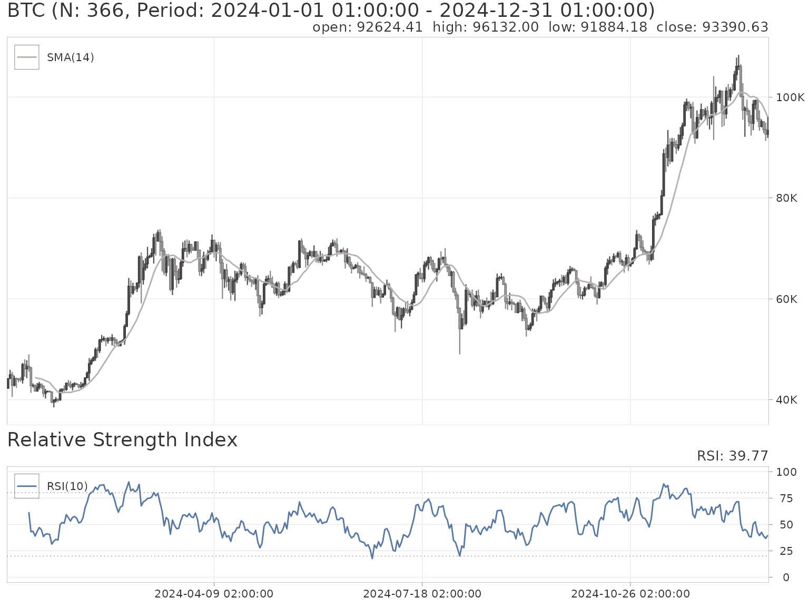

# Financial Charts

The [talib](https://serkor1.github.io/ta-lib-R/) package ships with a
charting system built on two backends: **plotly** (interactive, default)
and **ggplot2** (static). Charts are composed in two steps: create a
price chart with
[`chart()`](https://serkor1.github.io/ta-lib-R/reference/chart.md), then
layer on indicators with
[`indicator()`](https://serkor1.github.io/ta-lib-R/reference/indicator.md).

## Getting started

[`chart()`](https://serkor1.github.io/ta-lib-R/reference/chart.md) takes
any OHLCV object coercible to a `data.frame`. The package includes three
built-in datasets—`BTC`, `NVDA`, and `SPY`—used throughout this
vignette.

``` r
talib::chart(
  x = talib::NVDA
)
```

The chart title defaults to the name of the object passed to `x`.
Override it with the `title` argument.

``` r
talib::chart(
  x = talib::BTC,
  title = "Bitcoin (USDC)"
)
```

## Chart types

Two chart types are supported via the `type` argument: `"candlestick"`
(default) and `"ohlc"`.

``` r
talib::chart(
  x = talib::BTC,
  type = "ohlc"
)
```

## Adding indicators

Use
[`indicator()`](https://serkor1.github.io/ta-lib-R/reference/indicator.md)
to attach technical indicators to the most recent
[`chart()`](https://serkor1.github.io/ta-lib-R/reference/chart.md).
Indicators that overlay on price (e.g., Bollinger Bands, moving
averages) are drawn on the main panel. Indicators with their own scale
(e.g., RSI, MACD) are drawn in sub-panels below.

``` r
{
  talib::chart(talib::BTC)
  talib::indicator(talib::SMA, n = 7)
  talib::indicator(talib::SMA, n = 14)
  talib::indicator(talib::RSI)
}
```

Multiple sub-panel indicators stack vertically. The main chart occupies
70% of the height by default (controlled by `talib.chart.main`).

``` r
{
  talib::chart(talib::BTC)
  talib::indicator(talib::BBANDS)
  talib::indicator(talib::MACD)
  talib::indicator(talib::trading_volume)
}
```

### Combining indicators on one panel

By default, each sub-panel indicator (RSI, MACD, etc.) gets its own
panel. To merge multiple indicators onto the same panel, pass them as
**calls** to
[`indicator()`](https://serkor1.github.io/ta-lib-R/reference/indicator.md):

``` r
{
  talib::chart(talib::BTC)
  talib::indicator(
    talib::RSI(n = 10),
    talib::RSI(n = 14),
    talib::RSI(n = 21)
  )
}
```

Each indicator keeps its own arguments and receives a distinct color
from the active theme’s color palette. This works with any number of
indicators—and they don’t have to be the same type:

``` r
{
  talib::chart(talib::BTC)
  talib::indicator(
    talib::RSI(n = 14),
    talib::MACD()
  )
}
```

Combined panels and regular panels can be freely mixed in the same
chart:

``` r
{
  talib::chart(talib::BTC)
  talib::indicator(talib::BBANDS)
  talib::indicator(
    talib::RSI(n = 10),
    talib::RSI(n = 14),
    talib::RSI(n = 21)
  )
  talib::indicator(talib::MACD)
}
```

> **Note:** the syntax matters. `indicator(RSI, n = 14)` passes a
> function and arguments separately (single indicator).
> `indicator(RSI(n = 14), RSI(n = 21))` passes *calls* (combined panel).
> A single call like `indicator(RSI(n = 14))` also works and is
> equivalent to the single-indicator form.

### Standalone indicators

If no [`chart()`](https://serkor1.github.io/ta-lib-R/reference/chart.md)
has been called,
[`indicator()`](https://serkor1.github.io/ta-lib-R/reference/indicator.md)
can plot an indicator on its own—but you must supply the `data` argument
explicitly.

``` r
{
  ## clear any existing chart
  talib::chart()

  ## plot MACD by itself
  talib::indicator(
    FUN  = talib::MACD,
    data = talib::BTC
  )
}
```

### Clearing the chart state

Calling
[`chart()`](https://serkor1.github.io/ta-lib-R/reference/chart.md)
without arguments resets the internal charting environment. This is
useful when you want to start a fresh chart or plot a standalone
indicator after a previous
[`chart()`](https://serkor1.github.io/ta-lib-R/reference/chart.md) call.

``` r
{
  ## first chart
  talib::chart(talib::NVDA)
  talib::indicator(talib::RSI)
}
```

``` r
{
  ## reset and start fresh
  talib::chart()

  talib::chart(talib::BTC)
  talib::indicator(talib::MACD)
}
```

## X-axis labels

Internally, the charting system uses integer positions (`1:nrow(data)`)
on the x-axis for efficient alignment between the main chart and
sub-panels. By default, the axis shows these integer positions or the
row names of the data.

Pass a vector to the `idx` argument to display custom labels (e.g.,
dates).

``` r
{
  talib::chart(
    x   = talib::BTC,
    idx = rownames(talib::BTC)
  )
}
```

## Subsetting indicators

The `subset` argument lets you apply an indicator to a specific range of
the data without subsetting the data itself. This is useful for
comparing different indicators across different time windows.

``` r
{
  talib::chart(
    x   = talib::BTC,
    idx = rownames(talib::BTC)
  )

  talib::indicator(
    talib::BBANDS,
    subset = 1:nrow(talib::BTC) %in% 50:100
  )

  talib::indicator(
    talib::ACCBANDS,
    subset = 1:nrow(talib::BTC) %in% 101:151
  )
}
```

## Themes

The package includes a theme system that controls candle colors,
background, text, grid, and the color palette used for indicator traces.
Four built-in themes are available.

### Setting a theme

Use the `$` accessor on `set_theme` for tab-completion, or pass the
theme name as a string.

``` r
## equivalent ways to set a theme
talib::set_theme$payout
talib::set_theme("payout")

## list available theme names
talib::set_theme()
```

Themes persist across charts until changed. Set the theme *before*
calling
[`chart()`](https://serkor1.github.io/ta-lib-R/reference/chart.md).

### Default theme

The default theme uses a dark background with cyan and blue candles.

``` r
{
  talib::chart(talib::BTC)
  talib::indicator(talib::SMA, n = 7)
  talib::indicator(talib::SMA, n = 14)
  talib::indicator(talib::SMA, n = 21)
  talib::indicator(talib::SMA, n = 28)
  talib::indicator(talib::MACD)
  talib::indicator(talib::trading_volume)
}
```

### Hawks and Doves

A light theme with neutral grays.

``` r
{
  talib::set_theme$hawks_and_doves
  talib::chart(talib::BTC)
  talib::indicator(talib::SMA, n = 7)
  talib::indicator(talib::SMA, n = 14)
  talib::indicator(talib::SMA, n = 21)
  talib::indicator(talib::SMA, n = 28)
  talib::indicator(talib::MACD)
  talib::indicator(talib::trading_volume)
}
```

### Payout

A dark theme with teal and orange accents.

``` r
{
  talib::set_theme$payout
  talib::chart(talib::BTC)
  talib::indicator(talib::SMA, n = 7)
  talib::indicator(talib::SMA, n = 14)
  talib::indicator(talib::SMA, n = 21)
  talib::indicator(talib::SMA, n = 28)
  talib::indicator(talib::MACD)
  talib::indicator(talib::trading_volume)
}
```

### TP Slapped

A bright theme with teal and red candles on a light background.

``` r
{
  talib::set_theme$tp_slapped
  talib::chart(talib::BTC)
  talib::indicator(talib::SMA, n = 7)
  talib::indicator(talib::SMA, n = 14)
  talib::indicator(talib::SMA, n = 21)
  talib::indicator(talib::SMA, n = 28)
  talib::indicator(talib::MACD)
  talib::indicator(talib::trading_volume)
}
```

### Trust the Process

A light, muted theme with earthy tones.

``` r
{
  talib::set_theme$trust_the_process
  talib::chart(talib::BTC)
  talib::indicator(talib::SMA, n = 7)
  talib::indicator(talib::SMA, n = 14)
  talib::indicator(talib::SMA, n = 21)
  talib::indicator(talib::SMA, n = 28)
  talib::indicator(talib::MACD)
  talib::indicator(talib::trading_volume)
}
```

### Custom color overrides

Pass named color arguments to
[`set_theme()`](https://serkor1.github.io/ta-lib-R/reference/set_theme.md)
to override individual theme properties on top of a base theme.

``` r
{
  talib::set_theme(
    "payout",
    background_color = "#000000",
    bullish_body     = "#00FF00",
    bearish_body     = "#FF0000"
  )
  talib::chart(talib::BTC)
  talib::indicator(talib::RSI)
}
```

The full set of overridable properties: `bullish_body`, `bullish_wick`,
`bullish_border`, `bearish_body`, `bearish_wick`, `bearish_border`,
`background_color`, `foreground_color`, `text_color`, `threshold_color`,
`gridcolor`, and `colorway` (a vector of up to 10 colors for indicator
traces).

## Chart options

Global options control layout and display behavior. Set them with
[`options()`](https://rdrr.io/r/base/options.html) before calling
[`chart()`](https://serkor1.github.io/ta-lib-R/reference/chart.md).

| Option                    | Default    | Description                                                                  |
|:--------------------------|:-----------|:-----------------------------------------------------------------------------|
| `talib.chart.backend`     | `"plotly"` | Charting backend: `"plotly"` or `"ggplot2"`                                  |
| `talib.chart.slider`      | `FALSE`    | Add a range slider below the x-axis (plotly only)                            |
| `talib.chart.slider.size` | `0.05`     | Height proportion of the range slider                                        |
| `talib.chart.legend`      | `TRUE`     | Show the legend                                                              |
| `talib.chart.scale`       | `1`        | Font scale multiplier                                                        |
| `talib.chart.main`        | `0.7`      | Main chart height as a proportion of the total (when sub-panels are present) |
| `talib.chart.modebar`     | `NULL`     | Show the plotly modebar (`TRUE`/`FALSE`/`NULL` for auto)                     |

``` r
{
  options(
    talib.chart.slider = TRUE,
    talib.chart.scale  = 0.8,
    talib.chart.main   = 0.6
  )

  talib::chart(talib::SPY)
  talib::indicator(talib::RSI)
  talib::indicator(talib::BBANDS)
}
```

## Static charts with ggplot2

Set `talib.chart.backend` to `"ggplot2"` for static charts. This
requires the **ggplot2** package. The API is
identical—[`chart()`](https://serkor1.github.io/ta-lib-R/reference/chart.md)
and
[`indicator()`](https://serkor1.github.io/ta-lib-R/reference/indicator.md)
work the same way.

``` r
{
  options(talib.chart.backend = "ggplot2")
  talib::set_theme$hawks_and_doves

  talib::chart(talib::BTC)
  talib::indicator(talib::SMA, n = 14)
  talib::indicator(talib::RSI)
}
```


