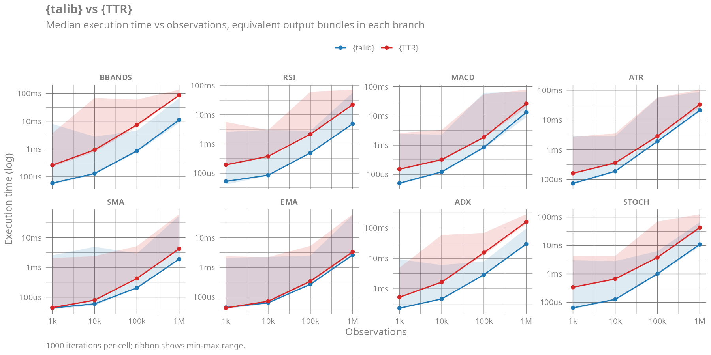
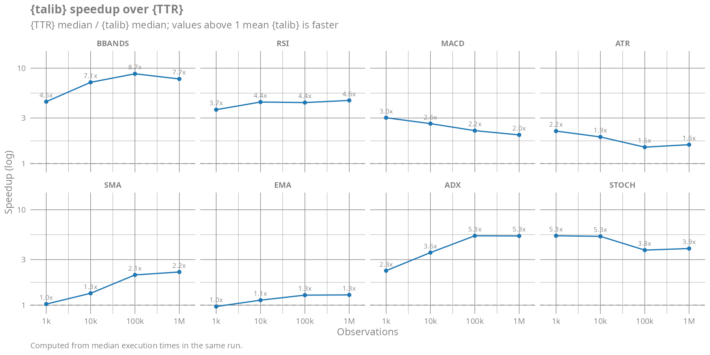
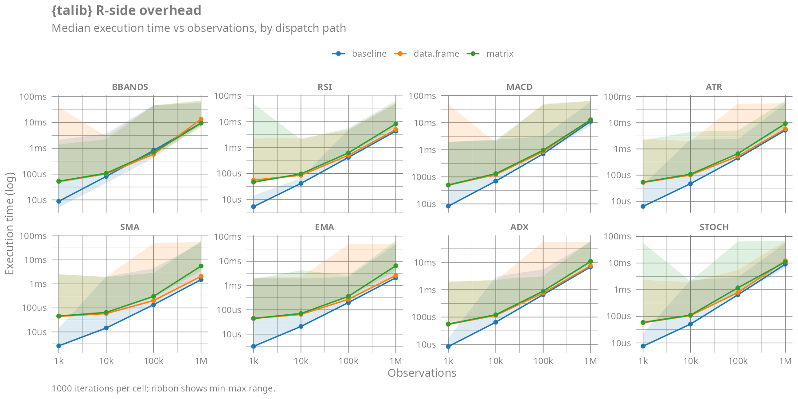

# Benchmarks

These benchmarks answer two questions:

1.  **How fast is `{talib}`?** We compare `{talib}` to
    [`{TTR}`](https://cran.r-project.org/package=TTR), the canonical R
    technical-analysis package, on eight indicators across the natural
    API in each package.
2.  **What does the R wrapper around `.Call` cost?** We measure three
    call paths into the same C routine: a bare `.Call`, the
    `<data.frame>` S3 method, and the `<matrix>` S3 method.

## Method

- **Indicators**: BBANDS, RSI, MACD, ATR, SMA, EMA, ADX, STOCH
- **Sizes**: 1,000 / 10,000 / 100,000 / 1,000,000 observations of
  synthetic OHLCV
- **Iterations**: 1000 timed iterations per cell, after 3 warmup calls
- **Sequential**: every `(indicator, n, expression)` cell is timed on
  its own, after a per-cell warmup
- **Engine**: [`bench::mark()`](https://bench.r-lib.org) with
  `filter_gc = FALSE`, `memory = TRUE`

Reported timings below are the **median** over the timed iterations.
Ribbons show the min-to-max range across iterations.

## `{talib}` vs `{TTR}`

`{talib}` is faster than `{TTR}` across every indicator and every size,
though the size of the speedup varies considerably and depends on what
each package computes internally.

The benchmark compares **equivalent output bundles**, not raw function
calls. `{TTR}` returns more columns than `{talib}` for several
indicators (`pctB` alongside Bollinger Bands; `tr` / `trueHigh` /
`trueLow` alongside ATR; `DIp` / `DIn` / `DX` alongside ADX; `fastK`
alongside the smoothed stochastic), and `{talib}` returns more for MACD
(`hist`). To keep the comparison apples-to-apples each branch produces
the same set of derived series per call: where the package’s API does
not return a column natively, the closure composes the equivalent talib
calls (or a one-line arithmetic derivation) to recover it. The residual
gap reflects the inner loops, not API shape.

- **Wide gap** is concentrated where `{TTR}` implements the indicator in
  pure R with rolling-window helpers that allocate intermediate vectors
  per step.
- **Narrow gap** appears for the moving averages (`SMA`, `EMA`) and a
  few others where `{TTR}`’s implementation is also C-backed via
  `.Call`. These facets are a fair benchmark of the wrappers, not of the
  algorithms.

<figure>

<figcaption aria-hidden="true">{talib} vs {TTR} – median execution time
across observations</figcaption>
</figure>

<figure>

<figcaption aria-hidden="true">{talib} speedup over {TTR}</figcaption>
</figure>

### Speedup at the largest size

<div align="center">

| Indicator | {talib} (median) | {TTR} (median) | Speedup |
|:----------|:-----------------|:---------------|:--------|
| BBANDS    | 11.2 ms          | 86.7 ms        | 7.7x    |
| RSI       | 4.9 ms           | 22.4 ms        | 4.6x    |
| MACD      | 13.2 ms          | 26.3 ms        | 2.0x    |
| ATR       | 21.1 ms          | 33.3 ms        | 1.6x    |
| SMA       | 1.9 ms           | 4.2 ms         | 2.2x    |
| EMA       | 2.6 ms           | 3.4 ms         | 1.3x    |
| ADX       | 29.6 ms          | 157.1 ms       | 5.3x    |
| STOCH     | 11.0 ms          | 42.9 ms        | 3.9x    |

n = 1,000,000 observations

</div>

## R-side overhead

For each indicator we time the same C routine three different ways:

1.  **baseline** – raw `.Call` directly into the registered native
    symbol, with the same arguments the wrapper would emit.
2.  **data.frame** – the natural `<data.frame>` S3 method (column
    selection via `series()`, result rewrapped via `map_dfr()`).
3.  **matrix** – the `<matrix>` S3 method (column selection via
    `series()`, no `map_dfr()`).

<figure>

<figcaption aria-hidden="true">{talib} R-side overhead by dispatch
path</figcaption>
</figure>

### Overhead at the largest size

<div align="center">

| Indicator | baseline | data.frame | matrix  | data.frame +% | matrix +% |
|:----------|:---------|:-----------|:--------|:--------------|:----------|
| BBANDS    | 9.5 ms   | 13.4 ms    | 9.4 ms  | +41.2%        | -1.2%     |
| RSI       | 4.4 ms   | 5.0 ms     | 8.3 ms  | +14.5%        | +90.6%    |
| MACD      | 11.2 ms  | 13.0 ms    | 12.7 ms | +15.6%        | +13.3%    |
| ATR       | 5.2 ms   | 5.8 ms     | 9.3 ms  | +12.2%        | +79.6%    |
| SMA       | 1.5 ms   | 2.1 ms     | 5.5 ms  | +37.8%        | +269.3%   |
| EMA       | 2.1 ms   | 2.6 ms     | 6.5 ms  | +24.1%        | +212.4%   |
| ADX       | 6.8 ms   | 7.5 ms     | 10.8 ms | +9.5%         | +58.6%    |
| STOCH     | 9.1 ms   | 12.3 ms    | 11.1 ms | +35.6%        | +22.5%    |

n = 1,000,000 observations

</div>

## Reproducing

``` bash
make bench
```

This runs `benchmark/run-all.R`, which writes RDS results and PNG plots
to `benchmark/results/`, then re-renders this README.
