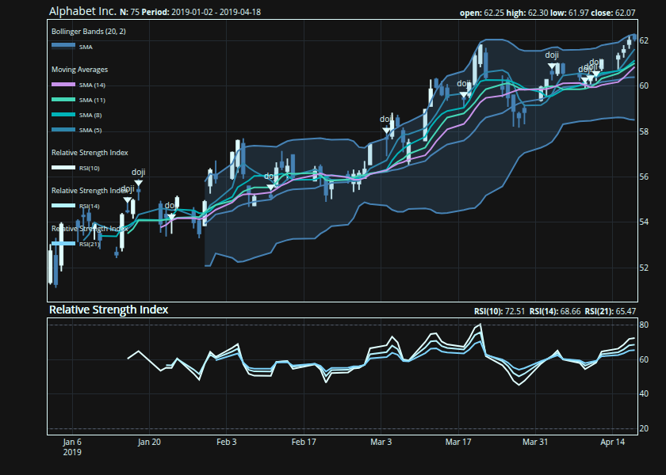

# {talib}: Fast TA-Lib indicators and candlestick patterns for R

[{talib}](https://serkor1.github.io/ta-lib-R/) provides fast R bindings
to the [TA-Lib](https://github.com/TA-Lib/ta-lib) C library for OHLCV
data: technical indicators, candlestick pattern recognition,
rolling-window utilities, and composable financial charts. It is
designed for researchers, analysts, and quant developers who need
technical-analysis features in R without building a heavy dependency
stack. Core computations are executed in C through
[`.Call()`](https://rdrr.io/r/base/CallExternal.html), while charting
support is available through optional
[{plotly}](https://github.com/plotly/plotly.R) and
[{ggplot2}](https://ggplot2.tidyverse.org/) integrations.[^1]

The API covers 150+ [TA-Lib](https://github.com/TA-Lib/ta-lib)-backed
functions across momentum, overlap, volatility, volume, cycle,
price-transform, rolling-statistics, and candlestick-pattern families,
including 61 candlestick pattern detectors.

## Why {talib}?

| Need | {talib} |
|:---|:---|
| Technical indicators | TA-Lib-backed moving averages, momentum, volatility, volume, cycle, and overlap studies |
| Candlestick patterns | Built-in Japanese candlestick pattern recognition |
| OHLCV workflows | Works directly with open, high, low, close, and volume columns |
| Performance | Computation delegated to C routines through [`.Call()`](https://rdrr.io/r/base/CallExternal.html) |
| Dependencies | Minimal required R dependencies; plotting packages are optional |
| Charts | Composable financial charts with optional [plotly](https://plotly-r.com) and [ggplot2](https://ggplot2.tidyverse.org) support |

## Installation[^2]

Install the release version from CRAN:

``` r

install.packages("talib")
```

Install the development version from GitHub:

``` r

pak::pak("serkor1/ta-lib-R")
```

## Quick start

All functions provide S3 methods for `<xts>`, `<data.frame>`,
`<matrix>`, and—where applicable—`<vector>` inputs. The general
convention is simple: the output uses the same container type as the
input.

``` r

## calculate the
## relative strength index
relative_strength_index <- talib::RSI(
    talib::GOOGL
)

## check class equivalence
inherits(
    relative_strength_index, 
    class(talib::GOOGL)
)
#> [1] TRUE

## display results
tail(
    relative_strength_index
)
#>                 RSI
#> 2021-12-22 53.47421
#> 2021-12-23 54.45979
#> 2021-12-27 56.42226
#> 2021-12-28 53.37121
#> 2021-12-29 53.28979
#> 2021-12-30 52.07450
```

Indicator outputs preserve input length, which keeps results aligned
with the original OHLCV rows.

``` r

## combine multiple
## indicators
features <- cbind(
    talib::relative_strength_index(talib::GOOGL),
    talib::bollinger_bands(talib::GOOGL),
    talib::engulfing(talib::GOOGL)
)

tail(features)
#>                 RSI UpperBand MiddleBand LowerBand CDLENGULFING
#> 2021-12-22 53.47421  149.1432   144.4920  139.8408            0
#> 2021-12-23 54.45979  149.2513   144.5318  139.8124            0
#> 2021-12-27 56.42226  149.6263   144.8180  140.0097            0
#> 2021-12-28 53.37121  149.7444   144.8758  140.0072         -100
#> 2021-12-29 53.28979  149.8398   145.1137  140.3876            0
#> 2021-12-30 52.07450  149.7308   145.3711  141.0115         -100
```

## Charting

[{talib}](https://serkor1.github.io/ta-lib-R/) comes with a composable
charting API built on two core functions:
[`indicator()`](https://serkor1.github.io/ta-lib-R/reference/indicator.md)
and
[`chart()`](https://serkor1.github.io/ta-lib-R/reference/chart.md)—both
functions are built on `model.frame` for maximum flexibility:

``` r

## subset data and
## store as 'GOOGL'
GOOGL <- talib::GOOGL[1:75, ]

## construct chart in a brace block
## alternatively use `|>`
{
    ## initialize main chart
    talib::chart(
        x     = GOOGL,
        title = "Alphabet Inc."
    )

    ## add Bollinger Bands to
    ## the existing chart
    talib::indicator(
        talib::BBANDS
    )

    ## add Simple Moving Averages (SMA)
    ## to the chart in a loop
    for (timePeriod in seq(5, 15, by = 3)) {
        talib::indicator(
            talib::SMA,
            timePeriod = timePeriod
        )
    }

    ## similar subchart indicators
    ## like the Relative Strength Index
    ## can be grouped to avoid repeated
    ## subpanels
    talib::indicator(
        talib::RSI(timePeriod = 10),
        talib::RSI(timePeriod = 14),
        talib::RSI(timePeriod = 21)
    )

    ## identify Doji patterns
    ## and add them to the chart
    talib::indicator(
        talib::doji
    )
}
```



## Implementation: {talib} vs upstream (TA-Lib Core)

Functions use descriptive snake_case names; each is aliased to its
[TA-Lib](https://github.com/TA-Lib/ta-lib) shorthand for compatibility
with the broader ecosystem, and to a camelCase name for consistency
across R’s finance ecosystem:

| Category | TA-Lib (C) | {talib} | {talib} alias | {talib} camelCase alias |
|:---|:---|:---|:---|:---|
| Overlap Studies | `TA_BBANDS()` | [`bollinger_bands()`](https://serkor1.github.io/ta-lib-R/reference/bollinger_bands.md) | [`BBANDS()`](https://serkor1.github.io/ta-lib-R/reference/bollinger_bands.md) | [`bollingerBands()`](https://serkor1.github.io/ta-lib-R/reference/bollinger_bands.md) |
| Momentum Indicators | `TA_CCI()` | [`commodity_channel_index()`](https://serkor1.github.io/ta-lib-R/reference/commodity_channel_index.md) | [`CCI()`](https://serkor1.github.io/ta-lib-R/reference/commodity_channel_index.md) | [`commodityChannelIndex()`](https://serkor1.github.io/ta-lib-R/reference/commodity_channel_index.md) |
| Volume Indicators | `TA_OBV()` | [`on_balance_volume()`](https://serkor1.github.io/ta-lib-R/reference/on_balance_volume.md) | [`OBV()`](https://serkor1.github.io/ta-lib-R/reference/on_balance_volume.md) | [`onBalanceVolume()`](https://serkor1.github.io/ta-lib-R/reference/on_balance_volume.md) |
| Volatility Indicators | `TA_ATR()` | [`average_true_range()`](https://serkor1.github.io/ta-lib-R/reference/average_true_range.md) | [`ATR()`](https://serkor1.github.io/ta-lib-R/reference/average_true_range.md) | [`averageTrueRange()`](https://serkor1.github.io/ta-lib-R/reference/average_true_range.md) |
| Price Transform | `TA_AVGPRICE()` | [`average_price()`](https://serkor1.github.io/ta-lib-R/reference/average_price.md) | [`AVGPRICE()`](https://serkor1.github.io/ta-lib-R/reference/average_price.md) | [`averagePrice()`](https://serkor1.github.io/ta-lib-R/reference/average_price.md) |
| Cycle Indicators | `TA_HT_SINE()` | [`sine_wave()`](https://serkor1.github.io/ta-lib-R/reference/sine_wave.md) | [`HT_SINE()`](https://serkor1.github.io/ta-lib-R/reference/sine_wave.md) | [`sineWave()`](https://serkor1.github.io/ta-lib-R/reference/sine_wave.md) |
| Pattern Recognition | `TA_CDLHANGINGMAN()` | [`hanging_man()`](https://serkor1.github.io/ta-lib-R/reference/hanging_man.md) | [`CDLHANGINGMAN()`](https://serkor1.github.io/ta-lib-R/reference/hanging_man.md) | [`hangingMan()`](https://serkor1.github.io/ta-lib-R/reference/hanging_man.md) |

### Interface: R vs Python

The main difference between the R and Python interfaces is how OHLCV
series are passed into each indicator function. Below is an example of
identifying `Doji` patterns in R and Python.

In Python, each series is passed independently:

``` python
import numpy as np
import talib

o = np.array([1, 1, 1, 1, 1, 1, 1, 1, 1, 1, 1], dtype=float)
h = np.array([2, 2, 2, 2, 2, 2, 2, 2, 2, 2, 2], dtype=float)
l = np.array([1, 1, 1, 1, 1, 1, 1, 1, 1, 1, 1], dtype=float)
c = np.array([2, 2, 2, 2, 2, 2, 2, 2, 2, 2, 1], dtype=float)

print(
    talib.CDLDOJI(o, h, l, c)
)
```

In R the series are passed as a tabular container:

``` r

ohlc <- data.frame(
    open  = c(1, 1, 1, 1, 1, 1, 1, 1, 1, 1, 1),
    high  = c(2, 2, 2, 2, 2, 2, 2, 2, 2, 2, 2),
    low   = c(1, 1, 1, 1, 1, 1, 1, 1, 1, 1, 1),
    close = c(2, 2, 2, 2, 2, 2, 2, 2, 2, 2, 1) 
)

talib::CDLDOJI(
    ohlc
)
```

All default series arguments are handled internally, and the `R`
interface is therefore higher-level: users pass one OHLC container
rather than manually splitting the series.

## Contributing and cloning

Contributions are welcome. For non-trivial changes, please open an issue
first to discuss the proposed design, API impact, and testing approach.

This repository vendors [TA-Lib](https://github.com/TA-Lib/ta-lib) as a
Git submodule. Clone the repository with submodules enabled:

``` sh
git clone --recurse-submodules https://github.com/serkor1/ta-lib-R.git
cd ta-lib-R
```

If you already cloned the repository without submodules, initialize them
with:

``` sh
git submodule update --init --recursive
```

Most indicator wrappers, helper functions, documentation fragments, and
unit tests are generated from the scripts in `codegen/`. The charting
interface is maintained separately.

Common development tasks are exposed through Make targets:

``` sh
make help
```

See CONTRIBUTING.md for the full development workflow.

## Code of Conduct

Please note that [{talib}](https://serkor1.github.io/ta-lib-R/) is
released with a [Contributor Code of
Conduct](https://contributor-covenant.org/version/2/1/CODE_OF_CONDUCT.html).
By contributing to this project, you agree to abide by its terms.

[^1]: See `benchmark/` for detailed benchmarks against
    [{TTR}](https://serkor1.github.io/ta-lib-R/) and general performance
    across multiple indicators.

[^2]: [talib](https://serkor1.github.io/ta-lib-R/) is a compiled
    package. CRAN binaries are available for standard platforms when
    provided by CRAN. Source installation requires a working compiler
    toolchain and [CMake](https://cmake.org/).
