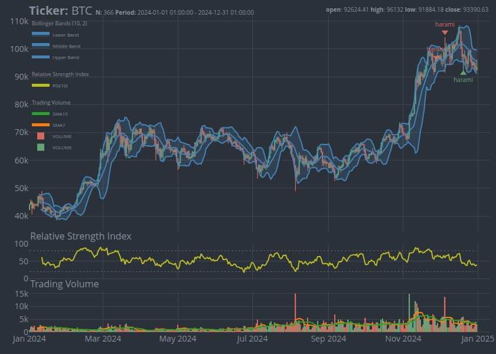

# {talib}: A Technical Analysis and Candlestick Pattern Library in R

[{talib}](https://serkor1.github.io/ta-lib-R/) is an `R`-package for
Technical Analysis and algorithmic Candlestick pattern recognition built
on the `C` library [TA-Lib](https://github.com/TA-Lib/ta-lib).
[{talib}](https://serkor1.github.io/ta-lib-R/) extends
[{TTR}](https://github.com/joshuaulrich/TTR) by adding Candlestick
pattern recognition to the pool of available indicators, and interactive
charts via [{plotly}](https://github.com/plotly/plotly.R).

[TA-Lib](https://github.com/TA-Lib/ta-lib) supports 200+ indicators for
Technical Analysis and Candlestick Patterns, all of which are available
in [{talib}](https://serkor1.github.io/ta-lib-R/).

## Types of Indicators and Interface

In the core C library functions are named as `TA_INDICATOR()` and
`TA_CDLPATTERN()` for indicators and patterns respectively. In the
`Python`-wrapper the functions are named `INDICATOR()` and
`CDLPATTERN()`—but this `R` package follows the [tidyverse
styleguide](https://style.tidyverse.org/) and therefore the naming is
inconsistent with the core library and the Python wrapper. See below for
an example of the mapping:

| Function Group        | TA-Lib (core)        | {talib}                                                                                                |
|:----------------------|:---------------------|:-------------------------------------------------------------------------------------------------------|
| Overlap Studies       | `TA_BBANDS()`        | [`bollinger_bands()`](https://serkor1.github.io/ta-lib-R/reference/bollinger_bands.md)                 |
| Momentum Indicators   | `TA_CCI()`           | [`commodity_channel_index()`](https://serkor1.github.io/ta-lib-R/reference/commodity_channel_index.md) |
| Volume Indicators     | `TA_OBV()`           | [`on_balance_volume()`](https://serkor1.github.io/ta-lib-R/reference/on_balance_volume.md)             |
| Volatility Indicators | `TA_ATR()`           | [`average_true_range()`](https://serkor1.github.io/ta-lib-R/reference/average_true_range.md)           |
| Price Transform       | `TA_AVGPRICE()`      | [`average_price()`](https://serkor1.github.io/ta-lib-R/reference/average_price.md)                     |
| Cycle Indicators      | `TA_HT_SINE()`       | `ht_sine_wave()`                                                                                       |
| Pattern Recognition   | `TA_CDLHANGINGMAN()` | [`hanging_man()`](https://serkor1.github.io/ta-lib-R/reference/hanging_man.md)                         |

However, each function in [{talib}](https://serkor1.github.io/ta-lib-R/)
is aliased so its consistent with the remaining ecosystem. See below:

``` r
all.equal(
    target = talib::bollinger_bands(talib::BTC),
    current = talib::BBANDS(talib::BTC)
)
#> [1] TRUE
```

The aliases are exported but are not a part of the documentation, but
they behave exactly the same as the main functions as demonstrated
above.

## Basic Usage

Below are an example on how to use
[{talib}](https://serkor1.github.io/ta-lib-R/) to calculate an
indicator, identify a candlestick pattern and charting it all together.

### Indicators

``` r
## identify Harami 
## patterns
tail(
    talib::harami(
        talib::BTC
    )
)
#>                     CDLHARAMI
#> 2024-12-26 01:00:00         0
#> 2024-12-27 01:00:00         0
#> 2024-12-28 01:00:00         0
#> 2024-12-29 01:00:00         0
#> 2024-12-30 01:00:00         0
#> 2024-12-31 01:00:00         0
```

``` r
## calculate bollinger
## bands
tail(
    talib::bollinger_bands(
        talib::BTC
    )
)
#>                     UpperBand MiddleBand LowerBand
#> 2024-12-26 01:00:00 104478.35   98217.88  91957.42
#> 2024-12-27 01:00:00 100877.73   97020.16  93162.59
#> 2024-12-28 01:00:00  99886.22   96516.01  93145.81
#> 2024-12-29 01:00:00  99871.12   96134.41  92397.71
#> 2024-12-30 01:00:00  99713.92   95620.42  91526.92
#> 2024-12-31 01:00:00  99373.89   95236.42  91098.95
```

### Charting

Below is an example on how to use
[`chart()`](https://serkor1.github.io/ta-lib-R/reference/chart.md) and
[`indicator()`](https://serkor1.github.io/ta-lib-R/reference/indicator.md).

``` r
{
    ## construct the chart
    ## with the default values
    ## (candlesticks by default)
    talib::chart(talib::BTC)

    ## chart the bollinger bands
    talib::indicator(
        talib::bollinger_bands
    )

    ## chart RSI
    talib::indicator(
        talib::RSI
    )

    ## chart volume
    talib::indicator(
        talib::trading_volume
    )

    ## identify 'Harami'-patterns
    ## from the last 66 candles and
    ## chart 
    talib::indicator(
        talib::harami,
        data = talib::BTC,
        subset = 1:nrow(talib::BTC) %in% 300:nrow(talib::BTC)
    )
}
```



## Installation[¹](#fn1)

[{talib}](https://serkor1.github.io/ta-lib-R/) can be installed using
[{pak}](https://github.com/r-lib/pak) from CRAN[²](#fn2), or Github.

### Install from source

The latest version of [{talib}](https://serkor1.github.io/ta-lib-R/) can
be installed directly from source. The vendoring of
[TA-Lib](https://github.com/TA-Lib/ta-lib) is handled by `configure` on
Windows, MacOS and Linux.

#### Using [{pak}](https://github.com/r-lib/pak)

``` r
## install remote
pak::pak("serkor1/ta-lib-R")
```

#### Using BASH

``` shell
git clone --recursive https://github.com/serkor1/ta-lib-R.git
cd ta-lib-R
make build
```

Use `make` to see package-level build-tools.

## Code of Conduct

Please note that [{talib}](https://serkor1.github.io/ta-lib-R/) is
released with a [Contributor Code of
Conduct](https://contributor-covenant.org/version/2/1/CODE_OF_CONDUCT.html).
By contributing to this project, you agree to abide by its terms.

------------------------------------------------------------------------

1.  [TA-Lib](https://github.com/TA-Lib/ta-lib) is vendored in
    [{talib}](https://serkor1.github.io/ta-lib-R/) via `CMake`, so it is
    not necessary to have [TA-Lib](https://github.com/TA-Lib/ta-lib)
    pre-installed. Some systems (Windows in particular) may require you
    to explicitly install and link `CMake` for
    [{talib}](https://serkor1.github.io/ta-lib-R/) to build properly.

2.  Not yet available.
